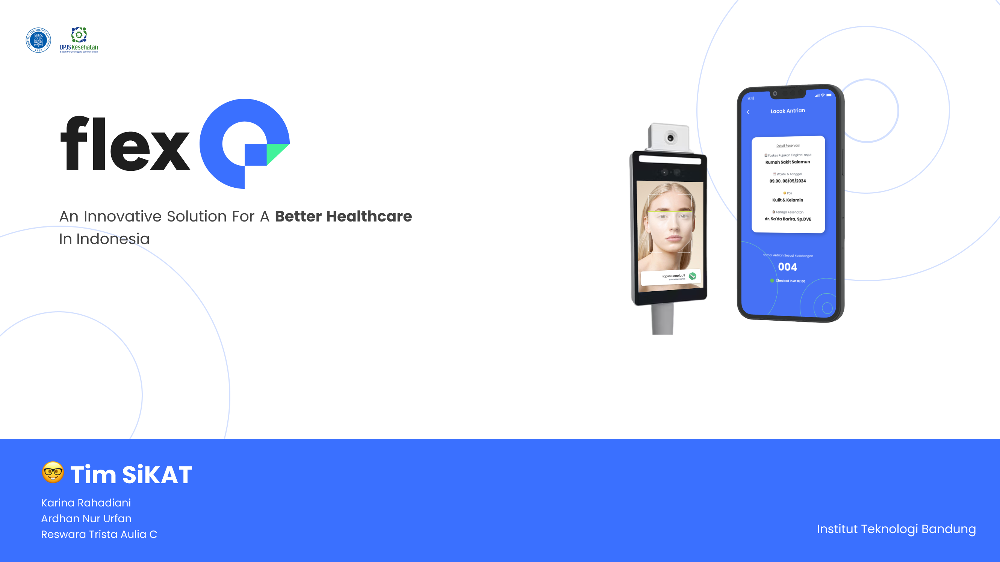
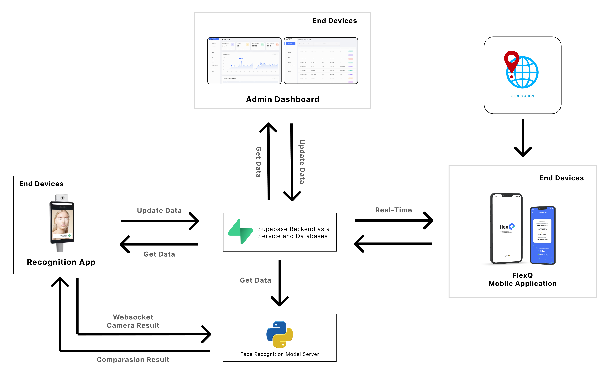

<h1 align="center">
   FlexQ Recognition Server
</h1>

<p align="center">
  
</p>

<hr>

## Links

> You can access this project **Presentation Document** [here]().

> You can access this project **Presentation Video** [here]().

> You can access the **Customer Mobile App** repository [here](https://github.com/SiKAT-Healthkathon/customer_flexQ).

> You can access the **Recognition App In Mobile Prototype** repository [here](https://github.com/SiKAT-Healthkathon/recognition_flexQ).

> You can access the **Admin Dashboard** repository [here](https://github.com/SiKAT-Healthkathon/admin-dashboard).

## Table of Contents

1. [General Information](#general-information)
2. [Technologies Used](#technologies-used)
3. [Installation](#installation)
4. [Our Team](#team)
5. [Copyright](#copyright)

<a name="general-information">

## General Information

Sistem pengenalan wajah yang diintegrasikan dengan notifikasi berbasis GPS untuk pendataan presensi dan manajemen antrian pasien di fasilitas kesehatan. Dengan memperbarui status kehadiran pasien secara otomatis setiap melewati device face recognizer, baik saat check-in maupun check-out dari area fasilitas. Notifikasi berbasis GPS akan mengirimkan pengingat kepada pasien untuk kembali ke fasilitas kesehatan berdasarkan jarak mereka.

<a name="technologies-used"></a>

## Technologies Used

This project using some technologies :

- Flutter 3.24.4 with Dart 3.5.4
- Web Socket
- Supabase
- Python Face Recognition
- Geolocation

### Architecture of Kiddy System

<p align="center">
  
</p>

Sistem kami menggunakan Flutter untuk membangun aplikasi mobile dan prototype untuk face recognition. Kemudian, menggunakan Supabase sebagai tempat penyimpanan data yang mampu mengakomodasi kebutuan data yang realtime. Supabase kami pilih karena biaya yang terjangkau untuk memulai pembuatan sebuah prototipe, serta performa yang sudah memenuhi kebutuhan dari sisi proses bisnis. Websocket yang dibangun menggunakan Python juga kami gunakan untuk keperluan untuk melakukan pendeteksian gambardari sistem kamera, melakukan komparasi dengan gambar dari database, kemudian mengirimkan kembali kepada aplikasi secara cepat dan real time. Kemudian, juga menggunakan Geolokasi untuk menentukan posisi tunggu pasien sehingga dapat memperkirakan waktu pengiriman notifikasi antrean.

<a name="installation">

## Installation

Then, run the development build:

Activate virtual environment

```bash
source venv/bin/activate
```

Install dependencies

```bash
pip install -r requirements.txt
```

and run application

```bash
python3 server.py
```

then, server will running in ws://localhost:8765

<a name="team">

## Our Team

| Nama             | E-Mail                      |
| ---------------- | --------------------------- |
| Ardhan Nur Urfan | 18221118@std.stei.itb.ac.id |
| Reswara Trista   | 18221122@std.stei.itb.ac.id |
| Karina Rahadiani | 18221104@std.stei.itb.ac.id |

<a name="copyright"></a>

## Copyright

<h4 align="center">
  Proposed for Healthkathon 2024 by SiKAT Team. Copyrights @2024
</h4>

</hr>
